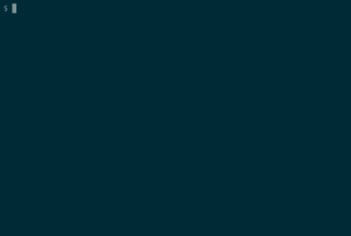

# Bypass Admin Brute Force

Author: _Revan AR_ from ***IndoSec***

_Proof of Concept_ tentang Bypass Admin Bruteforce, sebenarnya ini lebih mengarah ke kelemahan SQL dan ini hanya sebagai pengajaran saja.

### Kebutuhan

- Pehaman tentang HTML atau JS
- Pemahaman tentang HTTP POST Request
- Pemahaman tentang SQL

### Cara Kerja

Banyak sekali kelemahan pada program berbasis SQL ini yang terkadang abai dengan keamanan mereka.

#### Contoh Query Sederhana

```sql
SELECT * FROM `table_name` WHERE `username` = "usr" AND `password` = "key"
```

Dari query tersebut biasanya kita dapat menyelipkan query yang berbahaya, misalnya di bagian `usr` yang seharusnya berbentuk string ini ditambahi seperti `usr" OR "" = "" --` dimana hanya perlu memasukan `usr` kemudian menambahkan kondisi dimana kedua string sama dan di kasus ini menggunakan string kosong lalu langsung mengakhiri query dengan menambahkan `--` untuk menjadikan query berikutnya menjadi comment.

### Panduan

Cari tahu bagaimana alur program mengirimkan Kredensialnya, Misal Gateway Program berada di `example.com/admin/login` berisikan laman seperti dibawah ini

```html
<!-- Admin Login -->

<form action="/admin/login/validate" method="POST">
	<input type="text" name="username" placeholder="User">
	<input type="password" name="password" placeholder="Password">
	<input type="submit" name="submit" value="Sign in">
</form>
```

yang bisa kita amati secara langsung, misalnya saja hasil pengamatan kita mendapati kalau program mengirimkan kredensial langsung ke `example.com/admin/login/validate`

sekarang kita coba menjalankan alat ini

```bash
php baf.php
```



Demonstrasi di atas bisa saja berbeda tergantung komputer dan sistem yang anda gunakan

#### Contoh Kasus Pengamatan
Mungkin anda menemukan sebuah form dengan atribut `action` yang kosong seperti ini
```html
<form action="" method="POST">
	...
</form>
```
Anda hanya perlu menggunakan URL yang sama dengan laman tersebut, namun hal ini bisa tergantung juga dengan program yang anda analisa.

Terima kasih pada _Yogi Rahmat_ dari ***Error Violence*** atas ide yang diberikan untuk membahas konsep ini
